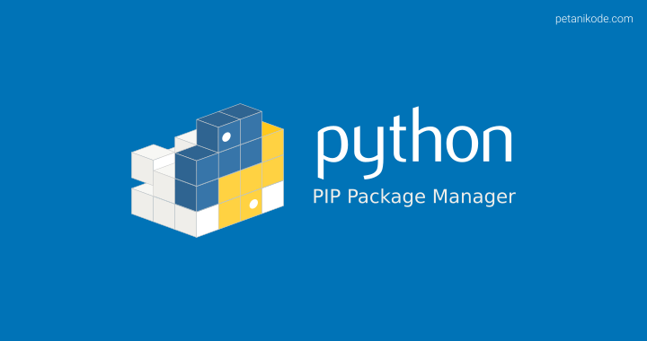

# آشنایی با pip

   

---
## pip چیست؟

یه مخزن بزرگ رو در نظر بگیر که توش یه عالمه پکیج هست. این مخزن بزرگ وبسایت 

pypi.org

هست.
اینجا دنیای پکیجهای پایتونه. هر پکیجی که بخوای داخل این قرار دادن. شمام میتونین یه پکیج بسازین و اینجا قرار بدین.

هر پکیجی که بخواین در حوزه های مختلف مثلا:

- حوزه وب
- دیتاساینس
- کار با سری های زمانی
- کار با مدیا (تصویر/ ویدیو و ...)

میلیون پکیج که هر کدوم رو متناسب با نیازتون میتونین برای خودتون نصب 
کنین. اما سوال اینجاس که چجوری نصب کنیم؟
> جواب: با **pip** یا همون پکیج منیجر پایتون

## چجوری یه پکیج نصب کنیم؟
کافیه اسم پکیج رو بدونین و با دستور 

`pip`

اون رو نصب کنین!

مثلا من میخوام هوش مصنوعی کار کنم و پکیجی میخوام که بتونم باهاش یادگیری عمیق کار کنم. 

- اول میرم توی گوگل یه سرچ میکنم پکیج میخوام با یادگیری عمیق که با پایتون هم باشه
- اونجا قطعا یه عالمه پیشنهاد بهتون میده و مثلا یکی شون `pytorch` هست

خب حالا با دستور زیر به راحتی اون رو نصب میکنم:
